```{r setup, include=FALSE}
knitr::opts_chunk$set(echo = TRUE)
```

This is a portfolio that I have compiled to demonstrate the skills I developed in VIS 2128 Spatial Analysis at Harvard University Graduate School of Design. 

I have created this page using RMarkdown and includes some maps that demonstrate the technical skills I acquired during the module. I intend to use these skills to map, analyze, and use spatial data to improve my understanding of places and spatial phenomenon at the regional, neighborhood, and site scales and to communicate my ideas and conclusions.

The portfolio is divided into categories of the cities I studied throughout the module. A summary of the skills demonstrated in this portfolio are as follows:

* Displaying data on an interactive map
* Displaying multiple vector layers on the same map
* Calculating and displaying relationships among point and polygon layers based on distance
* Aggregating point data to a layer of polygons
* Calculating and displaying accessibility, based on travel time
* Converting between raster layers and vector layers
* Displaying raster data on a map
* Georeferencing a raster image

# Mapping Boston

## Interactive Map
Here is an interactive map that shows the Percent of Construction Workers employed in the Service Sector in Boston who are commuting to work by transit.

[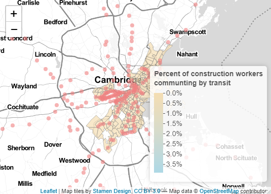](https://amnapervaiz.github.io/portfolio/fullsize/bostoninteractivemap.html){target="_blank"}

## Calculating Time Travel Matrix
This map shows the travel time from each public toilet structure in Boston to all the points in the grid. This is for transit - calculating time taken for people to walk up to 1000 meters to access a public toilet.

[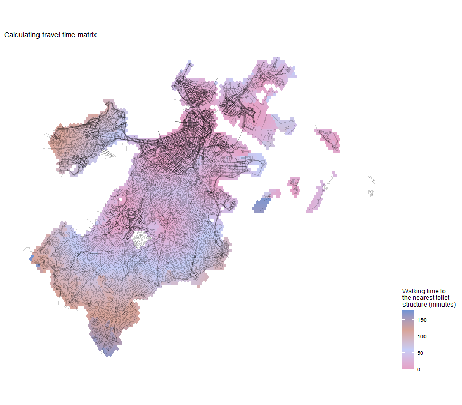](https://amnapervaiz.github.io/portfolio/fullsize/assignment4a.pdf){target="_blank"}

## Isochrones
This map shows isochrones based on transit travel times to the nearest school. Through displaying multiple vector layers on the same map, I am able to calculate and display accessibility, based on travel time.

[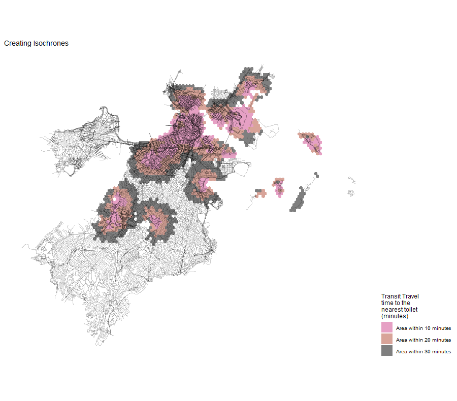](https://amnapervaiz.github.io/portfolio/fullsize/assignment4b.pdf){target="_blank"}

## Accessibility
The following maps show the accessibility and the accessibility score based on a distance-decay function of the walking time to the nearest transit stop in Boston. Here, I am displaying multiple vector layers on the same map, calculating and displaying accessibility, based on travel time, and then, displaying raster data on a map.

[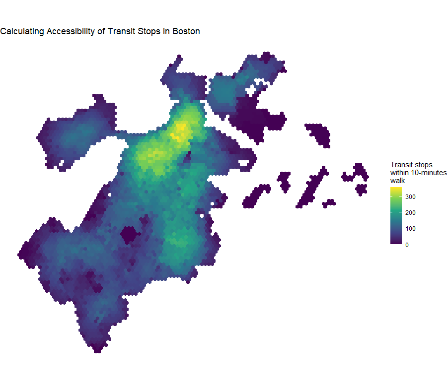](https://amnapervaiz.github.io/portfolio/fullsize/assignment4c.pdf){target="_blank"}
[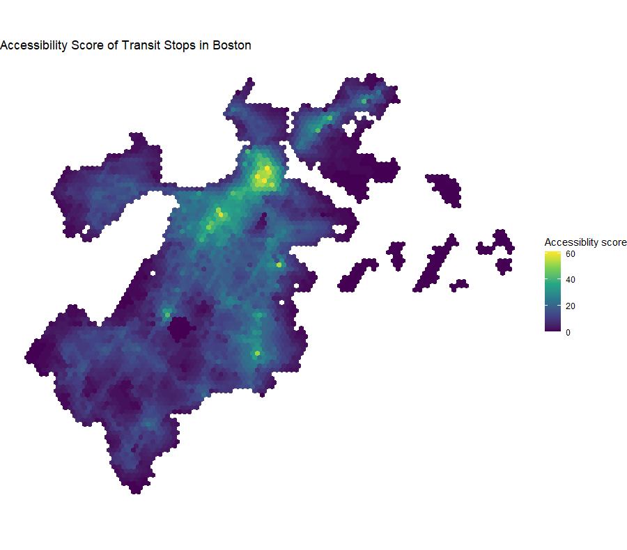](https://amnapervaiz.github.io/portfolio/fullsize/assignment4d.pdf){target="_blank"}
[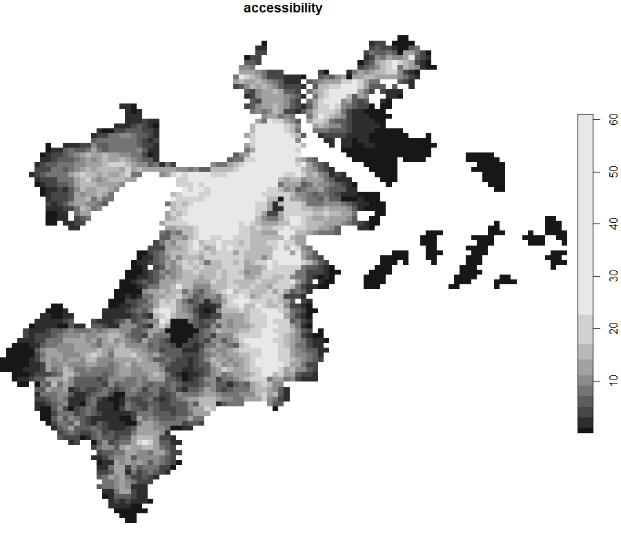](https://amnapervaiz.github.io/portfolio/fullsize/assignment4e.pdf){target="_blank"}
[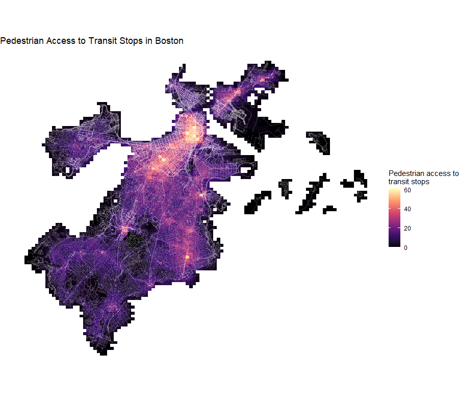](https://amnapervaiz.github.io/portfolio/fullsize/assignment4f.pdf){target="_blank"}
[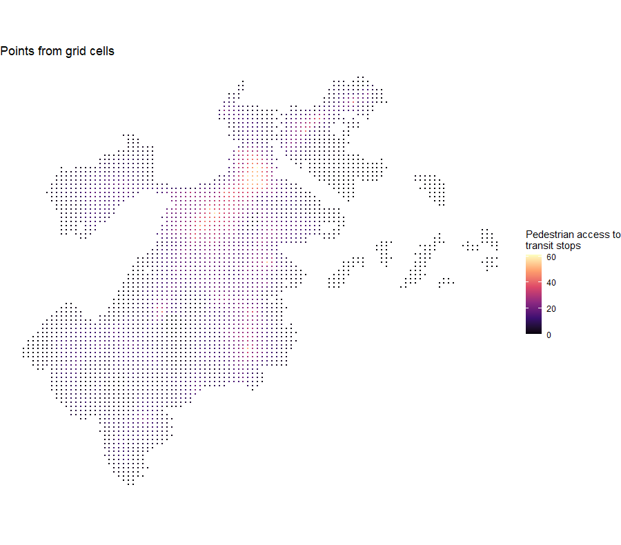](https://amnapervaiz.github.io/portfolio/fullsize/assignment4g.pdf){target="_blank"}
[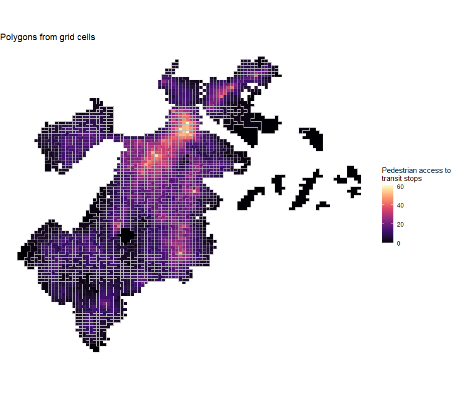](https://amnapervaiz.github.io/portfolio/fullsize/assignment4h.pdf){target="_blank"}
[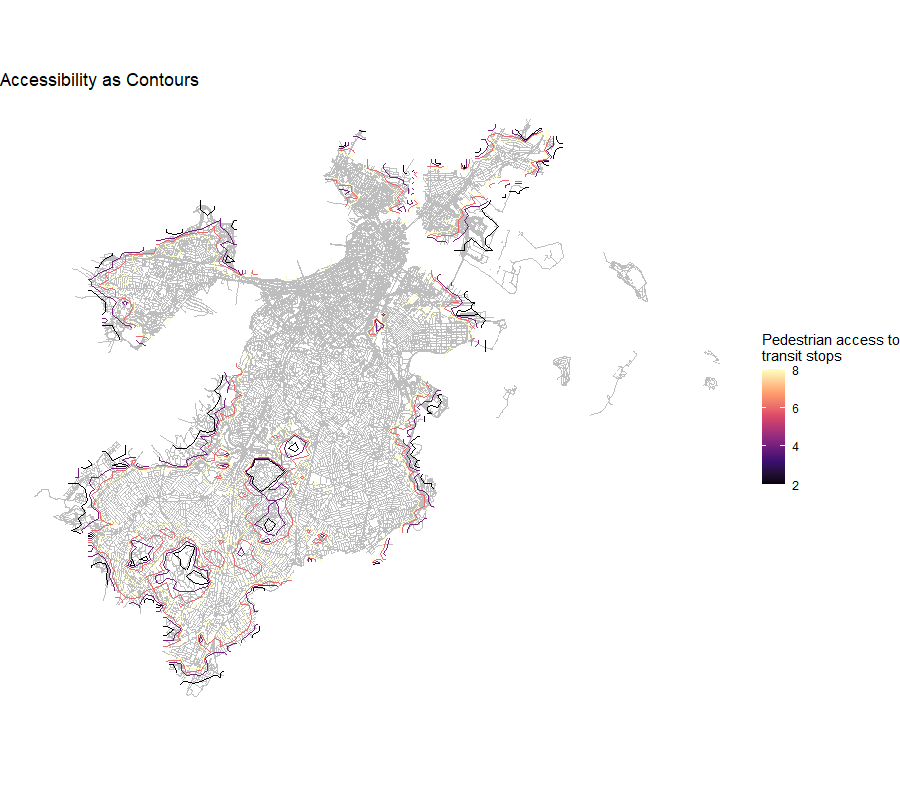](https://amnapervaiz.github.io/portfolio/fullsize/assignment4i.pdf){target="_blank"}

# Mapping San Francisco
## Georeferencing a Historic Map
This map includes a historic map of San Francisco from the early 20th century, collected from Harvard Map Archives. The goal was to highlight how specific aspects of the city has changed drastically throughout the years, particularly before and after the Great Fire of 1906 which brought about a direct transformation of the region. The fire alone accounted for more than 80 percent of total property damage from the disaster. This devastation interrupted the path of San Francisco’s social, political, and economic evolution. The following redevelopment effort greatly altered the structure of the city, introducing denser housing in areas. This difference in the density of residential buildings represents the result of a local disaster on the land use pattern in urban areas. 

[](https://amnapervaiz.github.io/portfolio/fullsize/assignment2.pdf){target="_blank"}

# Mapping Cambridge
## Calculating and displaying relationships between Points and Polygon layers
This map analyzes point and polygon layers. I first created a 50 meter buffer around each fire station (polygon layer) in Cambridge, sublet the hydrants (point layer) with the buffer zones, calculated percentages of hydrants within 50 meters of each fire station, and plotted a map of the calculations.

[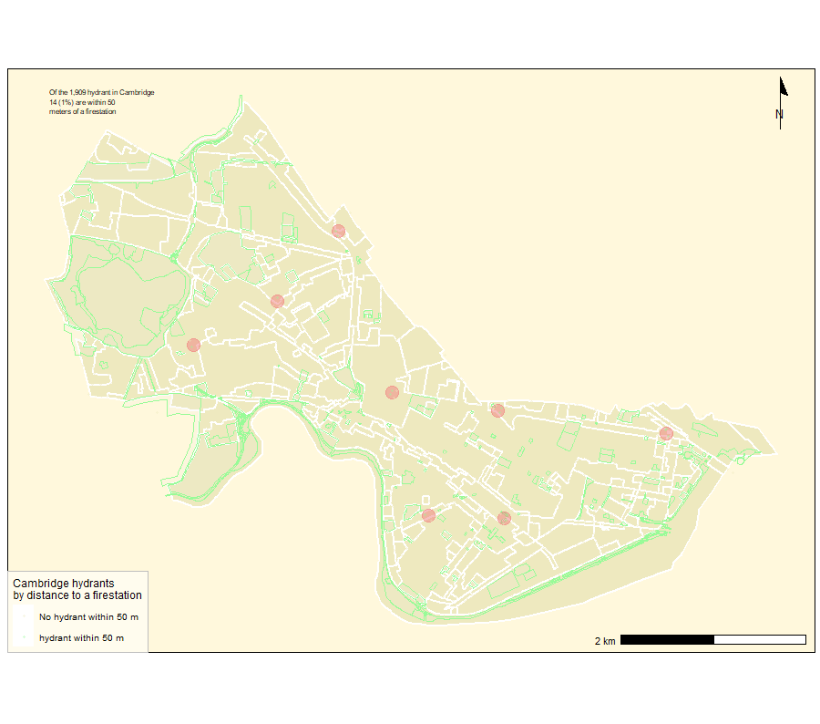](https://amnapervaiz.github.io/portfolio/fullsize/assignment3a.pdf){target="_blank"}

## Calculating and displaying relationships between different Point layers
This map analyzes multiple point layers. Here, I am trying to find the closest hydrant, by calculating how far each hydrant is from a fire station. I first calculated the average distance from a fire station to the nearest hydrant, set the map extents and plotted a map of the calculations.

[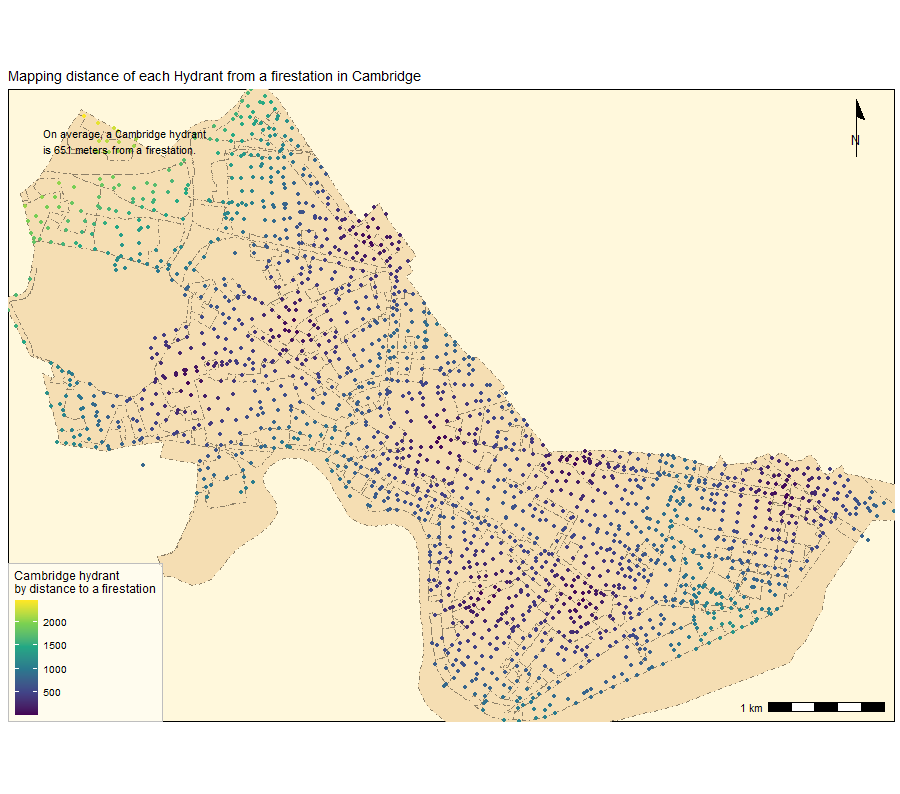](https://amnapervaiz.github.io/portfolio/fullsize/assignment3d.pdf){target="_blank"}

## Calculating and displaying relationships between different Polygon layers
This map analyzes overlapping polygon layers. Here, I’d like to know which zones in Cambridge have open spaces in them.

[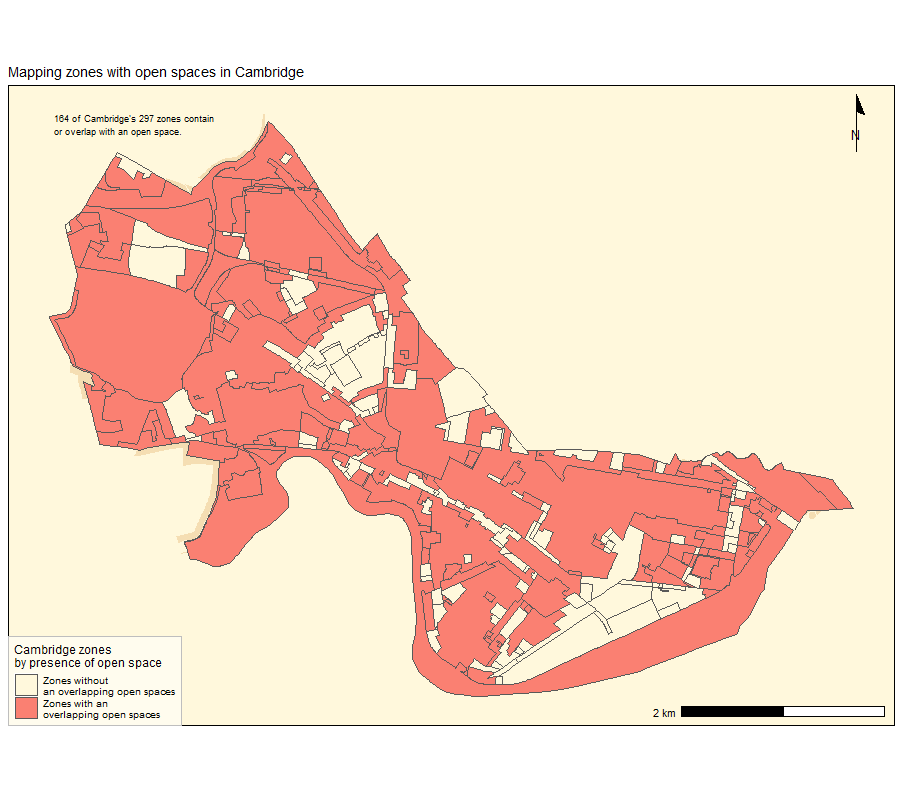](https://amnapervaiz.github.io/portfolio/fullsize/assignment3e.pdf){target="_blank"}
